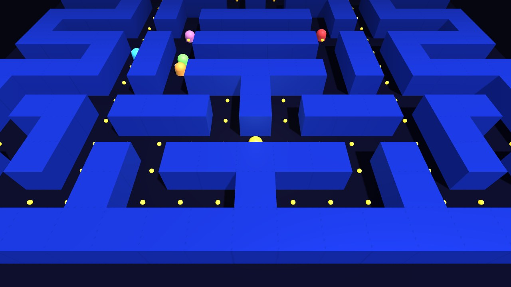

# Pac-Man 3D — Labirynt

> Przeglądarkowa gra 3D w stylu Pac-Mana napisana w czystym JavaScripcie i **Three.js** (WebGL), bez frameworków i bez kroku budowania.




## Dlaczego powstał ten projekt

Projekt zaliczeniowy z przedmiotu **IAM1** (Uniwersytet Śląski, Informatyka, III rok). Celem było zbudowanie interaktywnej aplikacji 3D działającej w przeglądarce i pokazanie w praktyce:

- jak zbudować scenę 3D (kamera, światła, cienie, mgła) w Three.js bez gotowego silnika gry,
- jak oddzielić **logikę gry** (siatka labiryntu, kolizje, AI przeciwników) od **renderowania**,
- jak zrobić pętlę gry niezależną od liczby klatek (`delta time`),
- jak dostarczyć aplikację, którą prowadzący uruchomi jednym kliknięciem — także bez internetu.

## Funkcje

- **Labirynt generowany z mapy ASCII** — poziom to tablica stringów (`#` ściana, `.` kropka, `P` start, `G` duszek), więc nową planszę projektuje się w edytorze tekstu.
- **Scena 3D** — oświetlenie kierunkowe z cieniami, mgła, animowane modele duszków.
- **AI duszków** — ruch po siatce; na każdym skrzyżowaniu 70% szans na wybór kierunku najbliższego graczowi, 30% losowo (dzięki temu duszki nie blokują się w jednym korytarzu). Duszek nie zawraca bez potrzeby.
- **Teleport** — `Spacja` przenosi gracza na losowe wolne pole, z 3-sekundowym czasem odnowienia widocznym w HUD.
- **Kolizje okrąg–siatka** dla gracza (promień kolizji, ślizganie się po ścianach).
- **HUD i stany gry** — wynik, życia, liczba kropek, ekran startu, przegranej i wygranej.
- **Pełna praca offline** — Three.js dołączony lokalnie (`three.min.js`), brak zależności od CDN.

## Sterowanie

| Klawisz | Akcja |
|---|---|
| `W` `A` `S` `D` / strzałki | Ruch |
| `Spacja` | Teleport (odnowienie 3 s) |

## Uruchomienie

**Windows:** dwuklik na `URUCHOM.bat` — skrypt sprawdza pliki, startuje lokalny serwer i otwiera grę pod `http://localhost:8765/index.html`.

**Ręcznie (dowolny system):**

```bash
python -m http.server 8765
# następnie otwórz http://localhost:8765/index.html
```

> Lokalny serwer HTTP jest zalecany — otwarcie `index.html` z `file://` bywa blokowane przez przeglądarki.

## Architektura

Całość mieści się w jednym pliku `index.html`, podzielonym na wyraźne sekcje:

```
USTAWIENIA / STAŁE   → parametry rozgrywki (rozmiar komórki, prędkości, cooldown, życia)
MAPA LABIRYNTU       → definicja poziomu w ASCII
SCENA / ŚWIATŁA      → renderer, kamera, oświetlenie, mgła
BUDOWA LABIRYNTU     → ściany i kropki tworzone na podstawie mapy
DUSZKI               → modele 3D + AI wyboru kierunku na siatce
TELEPORT / STEROWANIE→ obsługa klawiatury i teleportu
STAN GRY / HUD       → wynik, życia, start / koniec gry
PĘTLA GRY            → requestAnimationFrame + delta time
```

Logika ruchu działa na **współrzędnych siatki** (`worldToCell` / `cellToWorld`), a renderer tylko interpoluje pozycje. Dzięki temu AI i kolizje są proste i deterministyczne.

## Struktura repozytorium

```
pacman-3d/
├── index.html                 # gra: logika, scena 3D, UI
├── three.min.js               # Three.js r128 (licencja MIT)
├── URUCHOM.bat                # szybki start na Windows
├── JAK-URUCHOMIC.txt          # skrócona instrukcja
└── docs/
    ├── dokumentacja-techniczna.pdf
    ├── instrukcja-uzytkownika.pdf
    └── screenshots/
```

## Dokumentacja

- [Dokumentacja techniczna (PDF)](docs/dokumentacja-techniczna.pdf)
- [Instrukcja użytkownika (PDF)](docs/instrukcja-uzytkownika.pdf)

## Możliwe kierunki rozwoju

- Power-upy (klasyczne „energizery”) i tryb ucieczki duszków.
- Kilka poziomów wczytywanych z osobnych plików map.
- Wydzielenie kodu do modułów ES i testy jednostkowe logiki siatki.
- Publikacja przez GitHub Pages.

## Autor i licencje

**Maksym Litosh** — projekt edukacyjny, Uniwersytet Śląski w Katowicach.
[Three.js](https://threejs.org/) — licencja MIT, © 2010–2021 Three.js Authors.
